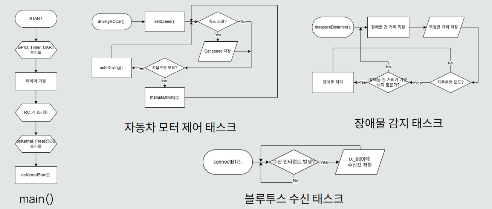

# STM32를 이용한 자율주행 RC카 
STM32에 DC모터 드라이버, 블루투스 모듈, 초음파 센서 등을 장착하여 자율주행 RC카를 설계했습니다. 휴대폰에 설치하는 블루투스 RC카 컨트롤러 앱으로 자동차의 주행 모드를 결정하거나 자동차를 직접 조종할 수 있습니다.
FreeRTOS로 UART 인터럽트, 장애물 간의 거리 측정, 바퀴(모터) 방향 제어 태스크를 사용합니다.
주행 모드는 ‘수동 조작 모드’와 ‘자율주행 모드’가 있습니다. 자율주행 모드일 때는 초음파 센서로 장애물과의 거리를 측정해서 RC카의 주행 방향을 결정합니다.

## 설계
### 외관

## 플로우차트

## Skills
- **STM32**
STM32CubeIDE로 개발했다. 코드는 C언어로 작성했다.
    - 초음파 센서(HC-SR04): 타이머
    자율주행 모드일 때만 사용하는 부품으로, 장애물과 RC카 사이의 거리를 측정한다. 거리 판단 기준은 코드로 직접 지정했다.
    - 블루투스 모듈(HC-06): UART 통신, 인터럽트
    UART 통신을 이용했다. 휴대폰의 블루투스 컨트롤러 앱으로부터 주행 명령어를 수신하면 UART 인터럽트가 발동하여 주행 방향이나 모드가 결정된다.
    - DC모터 드라이버(L298N): GPIO
    RC카 바퀴의 회전 방향을 결정한다.
- **FreeRTOS**
